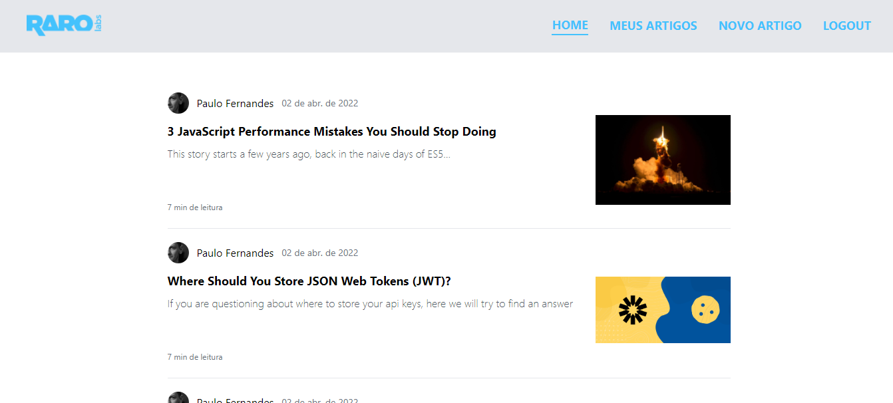

# Medium App

## 🧳 Tour no projeto

- Para conseguirmos desenvolver todas as funcionalidades que desejamos, vamos trabalhar com um repositório dos componentes básicos já iniciados. Este repositório poderá ser acessado aqui [nesse link](https://github.com/pauloFernandes/raro-academy-medium-app).
- Este projeto foi iniciado com o [create-react-app](https://create-react-app.dev/), uma biblioteca que nos ajuda com o setup de aplicações react, em geral, basicamente com quase tudo que precisamos, para começar.
- Para estilização dos componentes, optamos pelo uso do [tailwind](https://tailwindcss.com/). Esta biblioteca nos ajuda a criar um template legal, através de estilos pré-definidos e de fácil acesso, através de classes utilitárias.
- Como já desejávamos apresentar nosso componentes, ainda somente "recortados", utilizamos o [storybook](https://storybook.js.org/), que nos permite criar um ambiente de desenvolvimento, onde podemos testar os componentes que desejamos, ainda sem integra-los à aplicação como um todo. Esta modalidade de trabalho tende a criar componentes melhor documentado e melhor separados entre si.

## 🥳 Web page

## 📕 Requisitos da aplicação - Resumo

  - [x] Qualquer usuário pode acessar uma tela com a lista de todos os artigos
  - [x] Qualquer usuário pode acessar um artigo qualquer e consumir seu conteúdo
  - [x] Usuários podem fazer login na aplicação
  - [x] Usuários logados podem ver a lista com todos os seus artigos
  - [x] Usuários logados podem criar, editar e deletar artigos.
  - [x] Este tipo de aplicação exige que nossos usuários possam **navegar** por diferentes telas, cada uma com seu próprio aspecto, regras e funções.
  - [x] Ele nos demanda ainda que algumas das telas sejam acessíveis somente para usuários que atendam a determinadas condições. No nosso caso, o `CRUD` de artigos deve ser acessível somente para os usuários logados na nossa aplicação.

## 📖 Requisitos da aplicação - Cenários

#### **1. Funcionalidade: Consumo dos artigos publicados**

- Como usuário comum do sistema, logado ou em modo anônimo
- Quero ver a lista com todos os artigos publicados em nosso repositório

- [X] **Cenário: Lista de artigos publicados**
  - Dado que o usuário acesse o sistema de publicação de artigos
  - Quando o usuário navega para a tela de home
  - E existem artigos publicados
  - Então devem ser apresentados todos os artigos publicados
  - E os artigos deverão conter o título, o autor, a data de publicação e o resumo

- [X] **Cenário: Tela de listagem sem artigos publicados**
  - Dado que o usuário acesse o sistema de publicação de artigos
  - E não existem artigos publicados
  - Então o sistema deve apresentar uma mensagem dizendo que não existem artigos publicados

- [X] **Cenário: Acessar um artigo para leitura**
  - Dado que o usuário acesse o sistema de publicação de artigos
  - Quando o usuário navega para a tela de home
  - E o usuário selecionar um artigo
  - Então deve ser apresentado o artigo selecionado
  - E o artigo deverá conter o título, o autor e o conteúdo do artigo

#### **2. Funcionalidade: Login na plataforma**

- Como um usuário já cadastrado na plataforma
- Quero me autenticar no sistema
- Para que eu consiga criar e publicar artigos

- [X] **Cenário: Login realizado com sucesso**
  - Dado que o usuário acesse o sistema de publicação de artigos
  - E que não esteja logado na plataforma
  - Quando o usuário navega para a tela de login
  - E se autentica com usuário e senha corretos
  - Então o sistema redireciona este usuário para a tela de seus artigos

- [X] **Cenário: Login não realizado**
  - Dado que o usuário acesse o sistema de publicação de artigos
  - E que não esteja logado na plataforma
  - Quando o usuário navega para a tela de login
  - E tenta se autenticar com usuário ou senha incorretos
  - Então o sistema deve apresentar uma mensagem de erro "Usuário ou senha inválidos"
  - E o sistema não redireciona este usuário para a tela de seus artigos

- [X] **Cenário: Logout do sistema**
  - Dado que o usuário acesse o sistema de publicação de artigos
  - E que o usuário esteja logado na plataforma
  - Quando o usuário clica na opção "Logout"
  - Então o sistema deve deslogar o usuário e redirecionar este usuário para a tela listagem de artigos

#### **3. Funcionalidade: Navegação na plataforma**

- Como usuário comum do sistema, logado ou em modo anônimo
- Quero navegar pelas diversas Funcionalidade do sistema

- [X] **Cenário: Usuário não autenticado**
  - Dado que o usuário não esteja logado na plataforma
  - E acesse o sistema de publicação de artigos
  - Então o sistema deverá apresentar o menu de navegação para a tela de "home (listagem de artigos)"
  - E o sistema deverá apresentar o menu de navegação para a tela de "login"

- [X] **Cenário: Usuário autenticado**
  - Dado que o usuário esteja logado na plataforma
  - E acesse o sistema de publicação de artigos
  - Então o sistema deverá apresentar o menu de navegação para a tela de "home (listagem de artigos)"
  - E o sistema deverá apresentar o menu de navegação para a tela de "meus artigos"
  - E o sistema deverá apresentar o menu de navegação para a tela de "novo artigo"
  - E o sistema deverá apresentar o menu para logout

#### **4. Funcionalidade: Gestão dos meus artigos**

- Como um usuário já autenticado na plataforma
- Quero ver a lista dos artigos que eu publiquei
- Para que eu possa editar e excluir estes artigos

- [X] **Cenário: Usuário não possui artigos publicados**
  - Dado que o usuário autenticado acesse o sistema de publicação de artigos
  - E navegue para a tela de meus artigos
  - Quando o usuário não possui artigos publicados
  - Então o sistema deve apresentar uma mensagem reportando que não há artigos publicados

- [X] **Cenário: Usuário possui artigos publicados**
  - Dado que o usuário autenticado acesse o sistema de publicação de artigos
  - E navegue para a tela de meus artigos
  - Quando o usuário possui artigos publicados
  - Então o sistema deve apresentar todos os artigos publicados
  - E o sistema deverá apresentar a opção de editar o artigo

- [X] **Cenário: Criar um novo artigo**
  - Dado que o usuário autenticado acesse o sistema de publicação de artigos
  - E acesse a tela de novo artigo
  - Quando o usuário preenche todos os campos do cadastro do artigo
  - E clica em salvar
  - Então o sistema deve salvar o artigo
  - E redirecionar o usuário para a tela de exibição deste novo artigo //TODO

- [X] **Cenário: Editar um artigo**
  - Dado que o usuário autenticado acesse o sistema de publicação de artigos
  - E acesse a tela de artigos ou de meus artigos
  - E clique no botão de editar do artigo
  - Quando o usuário preenche todos os campos do cadastro do artigo
  - E clica em salvar
  - Então o sistema deve salvar o artigo
  - E redirecionar o usuário para a tela de exibição deste novo artigo

- [X] **Cenário: Excluir um artigo**
  - Dado que o usuário autenticado acesse o sistema de publicação de artigos
  - E acesse a tela de edição de determinado artigo
  - E clique no botão de excluir do artigo
  - Então o sistema deve excluir o artigo
  - E redirecionar o usuário para a tela de meus artigos

## 💻 Made with:

## 🛠️ Tools:

## 📚 Para executar localmente em modo desenvolvedor:

No diretório raiz do projeto execute:

- Para instalar as dependências `npm install`
- Para iniciar o projeto `npm start`

Copyright © 2022 ☕<a href="https://github.com/laripeanuts">laripeanuts</a>

